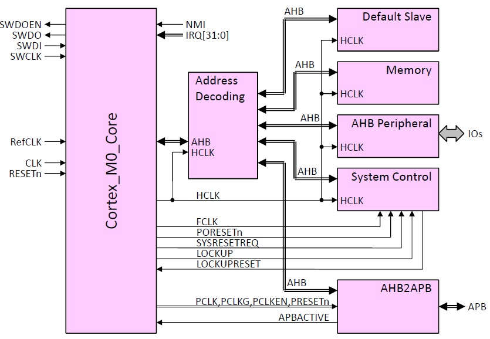
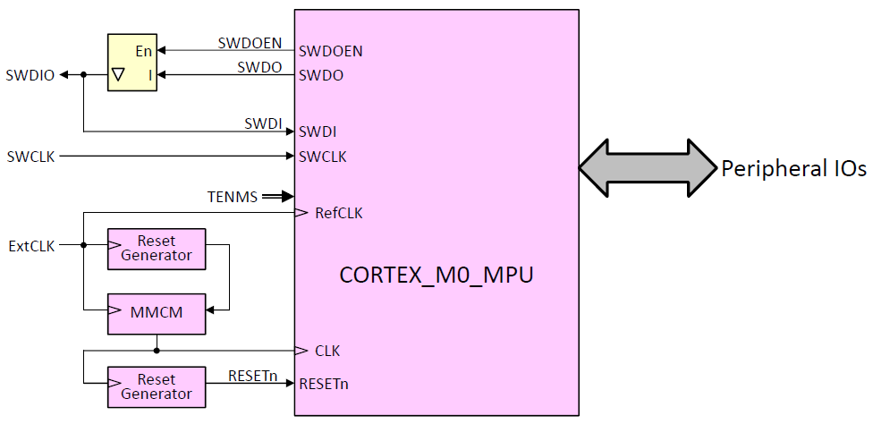
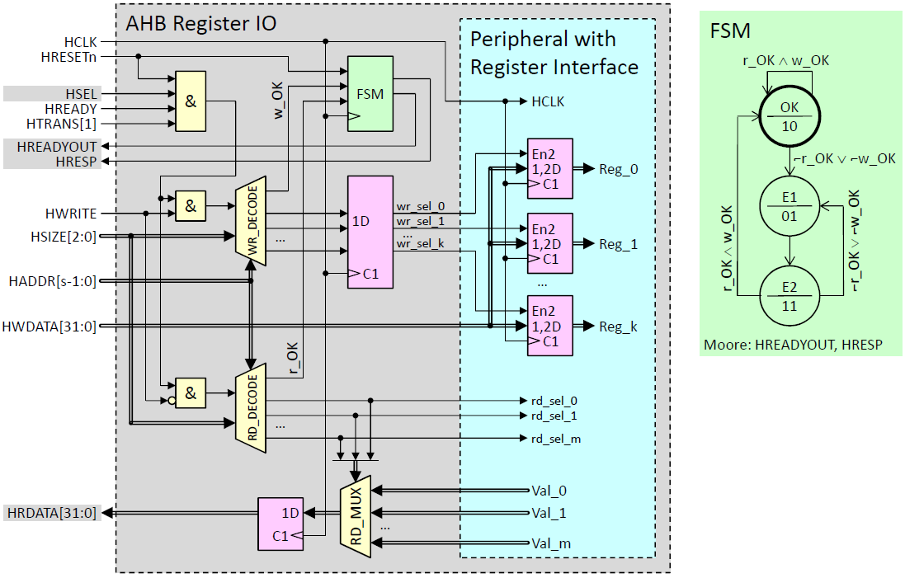

# Cortex-M0 DesignStart Eval System for [Cmod-A7 Board](https://reference.digilentinc.com/reference/programmable-logic/cmod-a7/start)

This project builds a minimum Cortex-M0 system with DesignStart Eval processor, blockram as memory an a simple IO on the AHB bus. The Debug port is available thus the system can be debugged via SWD.

Here is an image of the system, the AHB2APB bridge is not yet instanced:

The system is placed in a toplevel description:

The toplevel IOs are connected to the FPGA-pins. See `HDL\Cmod-A7\CORTEX_M0_MPU_TOP.xdc` for details.

As an example for an AHB peripheral the following design is included in the project:

 

The current system contains three registers, where only some of the signals are connected to FPGA output pins. See `HDL\Cmod-A7\CORTEX_M0_MPU_TOP.vhd` for details.

Besides the files in this projects some verilog files from DesignStart Eval Cortex-M0 are required to build the System. Download this eval package (see below) and add the files to the `HDL/Verilog`subdirectory.

When synthesizing the project the blockram is initalized from a `.hex` file. It is specified in `HDL\Cmod-A7\CORTEX_M0_MPU_TOP.vhd` as `constant Codefile`.

Several tools are required to synthesize  the hardware description and load the bitfile into the FPGA. Then the PC can connected to the Cortex-M0 via SWD using *ST-Link V2* and software can be debugged via eclipse. Below several links to the required tools are shown. All tools can be installed portable, e.g. in a `tools` directory.

A first simple assembler example can be found in Directory `Assembler_Basic`. A first simple example written in `C` can be found in directory `C_Basic`.  

A Program which uses the timer and lets all LEDs of the board blink is given in `Eclipse_WS\C_New`.

 Have a look at the batches in the `Batches` directory which help to start eclipse, openocd and telnet.

## DesignStart Eval Sources

[Download at ARM](https://developer.arm.com/ip-products/designstart/eval)

## Tools for building the Hardware

Xilinx: [Vivado](https://www.xilinx.com/support/download/index.html/content/xilinx/en/downloadNav/vivado-design-tools.html)

## Tools for building the Software

Sometimes alternative download sites are listed.

#### `Make` and required `Binutils` 

- GNUWIN32 Project: [coreutils](http://gnuwin32.sourceforge.net/packages/coreutils.htm), [make](http://gnuwin32.sourceforge.net/packages/make.htm)
- xpack: [Windows Build Tool](https://xpack.github.io/windows-build-tools/)

#### GNU-Compiler for ARM-Cortex

- ARM: [gnu-toolchain](https://developer.arm.com/tools-and-software/open-source-software/developer-tools/gnu-toolchain/gnu-rm)
- xpack: [gnu-toolchain](https://xpack.github.io/arm-none-eabi-gcc/)

#### OpenOCD

- gnutoolchains.com: [openocd](https://gnutoolchains.com/arm-eabi/openocd/)
- xpack: [openocd](https://xpack.github.io/openocd/)

#### Telnet

[Hint how to activate Telnet in Windows 10 (in german)](https://www.heise.de/tipps-tricks/Windows-10-Telnet-Client-aktivieren-4569277.html)

#### Eclipse

[Eclipse IDE for C-Developers](https://www.eclipse.org/downloads/packages/release/2020-09/r/eclipse-ide-cc-developers)

------

# Have much fun!

